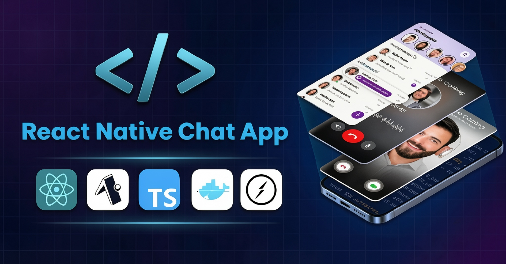
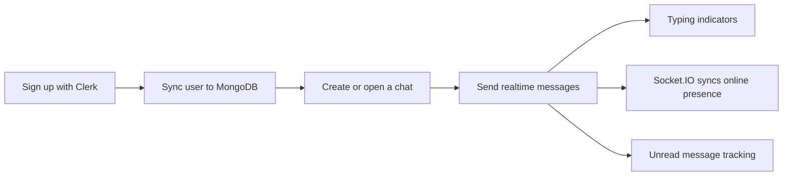
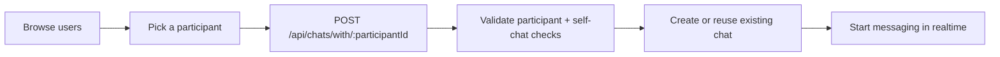
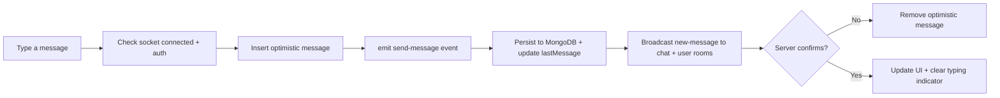
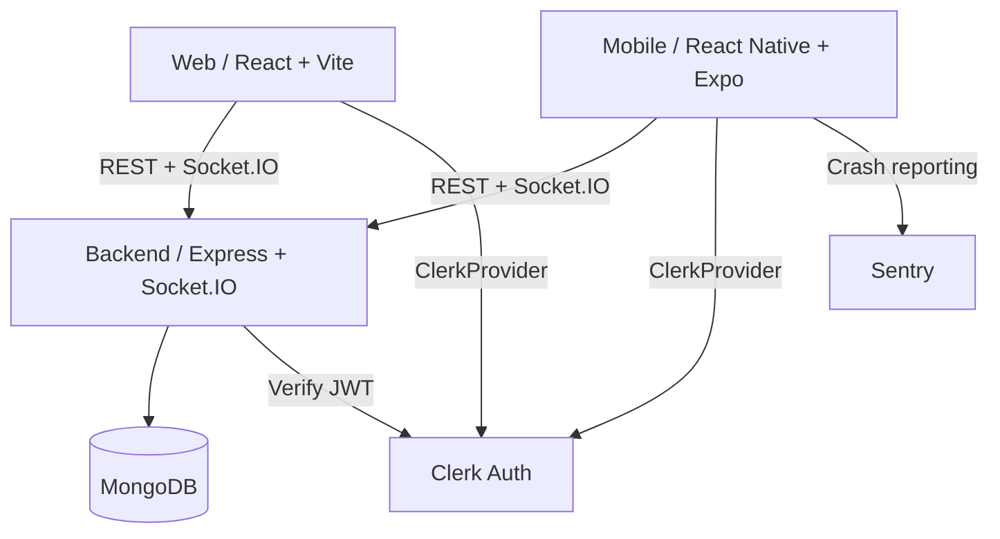

<h1 align="center">✨Chatpulse Full-Stack Realtime Chat App ✨</h1>



<p align="center">
  <a href="https://github.com/1234Giorgi/opaa">
    
  </a>
  <a href="https://github.com/1234Giorgi/opaa/blob/main/LICENSE">
    
  </a>
  <a href="https://github.com/1234Giorgi/opaa/stargazers">
    
  </a>
  <a href="https://github.com/1234Giorgi/opaa/issues">
    
  </a>
  <a href="https://github.com/1234Giorgi/opaa/commits/main">
    
  </a>
</p>

<p align="center">
  
  
  
  
  
  
  
  
  
  
  
  
  
</p>

<p align="center">
  
  
  
</p>

---

## 🚀 Overview

**Chatpulse** is a modern, full-stack real-time chat application built from the ground up — no Firebase, no Pusher, no Ably. It features a custom **Socket.IO** server for real-time communication, **Clerk** for authentication, **MongoDB** for data persistence, and a shared backend serving both a **React web app** and a **React Native (Expo) mobile app**.

> **Built with a monorepo architecture** — one backend powers both web and mobile clients with identical features and real-time capabilities.

---

## 🔄 How It Works

### Workspace Flow



### Public Form Flow



### AI Flow



### Architecture Overview



---

## ✨ Features

### Core Features

| Feature                     | Description                                                   |
| --------------------------- | ------------------------------------------------------------- |
| 📱 **Mobile App**           | Fully functional React Native chat app with Expo              |
| 💻 **Web App**              | React + Vite SPA with the same real-time features             |
| 💬 **Real-Time Messaging**  | Custom Socket.IO server — zero third-party messaging services |
| ⌨️ **Typing Indicators**    | See when others are typing in real-time                       |
| 🟢 **Online Presence**      | Live online/offline status for all users                      |
| 🔐 **Authentication**       | Clerk-powered auth across web, mobile, and backend            |
| 🌐 **Shared Backend**       | One Express + MongoDB API serves both clients                 |
| 🧠 **Custom Socket Server** | Handcrafted WebSocket layer with Socket.IO                    |
| 🎨 **Modern UI**            | Clean, responsive design with Tailwind CSS & NativeWind       |
| 📱 **Cross-Platform**       | iOS, Android, and Web from a single codebase                  |
| 🛠️ **REST API**             | Well-structured REST endpoints for chats, messages, and users |
| 🧪 **Error Monitoring**     | Sentry integration for crash reporting & performance tracing  |
| 🚀 **Docker Ready**         | Multi-stage Dockerfile for production deployment              |
| 🌱 **DevOps Ready**         | Feature branches, PRs, automated code reviews with CodeRabbit |

### Real-Time Capabilities

- **WebSocket-based messaging** with Socket.IO
- **Optimistic UI updates** for instant message delivery
- **Presence system** — online/offline status synced across clients
- **Typing indicators** with auto-timeout
- **Unread message tracking** (mobile)
- **Chat room joining/leaving** for efficient event broadcasting

---

## 🏗️ Architecture

```
Chatpulse/
├── backend/              # Express + MongoDB + Socket.IO API
│   ├── src/
│   │   ├── config/       # Database configuration
│   │   ├── controllers/  # Route controllers (auth, chat, message, user)
│   │   ├── middleware/   # Auth & error handling middleware
│   │   ├── models/       # Mongoose models (User, Chat, Message)
│   │   ├── routes/       # REST API routes
│   │   ├── scripts/      # Database seeding
│   │   └── utils/        # Socket.IO server setup
│   ├── index.ts          # Server entry point
│   └── tsconfig.json
├── web/                  # React + Vite web client
│   ├── src/
│   │   ├── components/   # Reusable UI components
│   │   ├── hooks/        # Custom React hooks
│   │   ├── lib/          # Axios, Socket.IO client, utilities
│   │   └── pages/        # Page components
│   ├── index.html
│   └── vite.config.js
├── mobile/               # React Native + Expo mobile client
│   ├── app/              # Expo Router file-based routing
│   │   ├── (auth)/       # Authentication flow
│   │   ├── (tabs)/       # Tab navigation (Chats, Profile)
│   │   ├── chat/         # Chat detail screen
│   │   └── new-chat/     # New chat creation
│   ├── components/       # Reusable RN components
│   ├── hooks/            # Custom React hooks
│   ├── lib/              # Axios, Socket.IO client
│   ├── types/            # TypeScript type definitions
│   └── assets/           # Images, icons
├── Dockerfile            # Multi-stage Docker build
├── .dockerignore
└── README.md
```

---

## ⚙️ Tech Stack

### Backend

| Technology     | Purpose                                         |
| -------------- | ----------------------------------------------- |
| **Bun**        | JavaScript/TypeScript runtime & package manager |
| **Express**    | Web framework for REST API                      |
| **MongoDB**    | NoSQL database (via Mongoose ODM)               |
| **Socket.IO**  | Real-time WebSocket communication               |
| **Clerk**      | Authentication & user management                |
| **TypeScript** | Type-safe backend development                   |

### Web

| Technology           | Purpose                        |
| -------------------- | ------------------------------ |
| **React 19**         | UI library                     |
| **Vite**             | Build tool & dev server        |
| **Tailwind CSS**     | Utility-first CSS framework    |
| **DaisyUI**          | Component library for Tailwind |
| **TanStack Query**   | Server state management        |
| **Socket.IO Client** | Real-time communication        |
| **Clerk React**      | Authentication                 |
| **React Router**     | Client-side routing            |

### Mobile

| Technology           | Purpose                            |
| -------------------- | ---------------------------------- |
| **React Native**     | Cross-platform mobile framework    |
| **Expo**             | Toolchain & dev platform           |
| **NativeWind**       | Tailwind CSS for React Native      |
| **Expo Router**      | File-based routing                 |
| **TanStack Query**   | Server state management            |
| **Socket.IO Client** | Real-time communication            |
| **Clerk Expo**       | Authentication                     |
| **Sentry**           | Error monitoring & crash reporting |
| **date-fns**         | Date formatting                    |

---

## 🚀 Getting Started

### Prerequisites

- **Node.js** >= 18
- **Bun** (recommended) or npm/yarn
- **MongoDB** instance (local or Atlas)
- **Clerk** account (for authentication keys)
- **Sentry** account (optional, for error monitoring)

### 1. Clone the Repository

```bash
git clone https://github.com/GiorgiKavtaradze-prog/Chatpulse.git
cd Chatpulse
```

### 2. Set Up Environment Variables

#### Backend (`/backend`)

Create a `.env` file in the `backend/` directory:

```bash
# MongoDB
MONGODB_URI=<YOUR_MONGO_URI>

# Server
PORT=3000
NODE_ENV=development

# Clerk Authentication
CLERK_PUBLISHABLE_KEY=<YOUR_CLERK_PUBLISHABLE_KEY>
CLERK_SECRET_KEY=<YOUR_CLERK_SECRET_KEY>

# Frontend URLs (for CORS)
FRONTEND_URL=http://localhost:5173
```

#### Web (`/web`)

Create a `.env` file in the `web/` directory:

```bash
# Clerk
VITE_CLERK_PUBLISHABLE_KEY=<YOUR_CLERK_PUBLISHABLE_KEY>

# API
VITE_API_URL=http://localhost:3000

# Sentry (optional)
VITE_SENTRY_DSN=<YOUR_SENTRY_DSN>
```

#### Mobile (`/mobile`)

Create a `.env` file in the `mobile/` directory:

```bash
# Clerk
EXPO_PUBLIC_CLERK_PUBLISHABLE_KEY=<YOUR_CLERK_PUBLISHABLE_KEY>

# Sentry (optional)
SENTRY_AUTH_TOKEN=<YOUR_SENTRY_AUTH_TOKEN>
```

### 3. Install Dependencies

```bash
# Backend
cd backend
bun install

# Web
cd ../web
npm install

# Mobile
cd ../mobile
npm install
```

### 4. Run the Applications

#### Backend

```bash
cd backend
bun run dev
```

The API server will be available at `http://localhost:3000`.

#### Web

```bash
cd web
npm run dev
```

The web app will be available at `http://localhost:5173`.

#### Mobile

```bash
cd mobile
npx expo start
```

Scan the QR code with the **Expo Go** app on your phone, or run on a simulator:

```bash
# Run on Android
npm run android

# Run on iOS
npm run ios
```

---

## 📡 API Reference

### Authentication

| Method | Endpoint             | Description                 | Auth Required |
| ------ | -------------------- | --------------------------- | ------------- |
| `GET`  | `/api/auth/me`       | Get current user profile    | ✅            |
| `POST` | `/api/auth/callback` | Sync Clerk user to database | ❌            |

### Chats

| Method | Endpoint                         | Description                      | Auth Required |
| ------ | -------------------------------- | -------------------------------- | ------------- |
| `GET`  | `/api/chats`                     | Get all chats for current user   | ✅            |
| `POST` | `/api/chats/with/:participantId` | Create or get a chat with a user | ✅            |

### Messages

| Method | Endpoint                     | Description                | Auth Required |
| ------ | ---------------------------- | -------------------------- | ------------- |
| `GET`  | `/api/messages/chat/:chatId` | Get all messages in a chat | ✅            |

### Users

| Method | Endpoint     | Description                       | Auth Required |
| ------ | ------------ | --------------------------------- | ------------- |
| `GET`  | `/api/users` | Get all users (excluding current) | ✅            |

### Health Check

| Method | Endpoint  | Description          |
| ------ | --------- | -------------------- |
| `GET`  | `/health` | Server health status |

---

## 🔌 Socket.IO Events

### Client → Server

| Event          | Payload                | Description                            |
| -------------- | ---------------------- | -------------------------------------- |
| `join-chat`    | `chatId: string`       | Join a chat room for real-time updates |
| `leave-chat`   | `chatId: string`       | Leave a chat room                      |
| `send-message` | `{ chatId, text }`     | Send a message to a chat               |
| `typing`       | `{ chatId, isTyping }` | Notify others of typing status         |

### Server → Client

| Event          | Payload                        | Description                        |
| -------------- | ------------------------------ | ---------------------------------- |
| `online-users` | `{ userIds: string[] }`        | List of currently online user IDs  |
| `user-online`  | `{ userId: string }`           | A user came online                 |
| `user-offline` | `{ userId: string }`           | A user went offline                |
| `new-message`  | `Message`                      | A new message was received         |
| `typing`       | `{ userId, chatId, isTyping }` | Typing indicator from another user |
| `socket-error` | `{ message: string }`          | Error from the server              |

---

## 🌱 Seeding the Database

The backend includes a seed script to populate the database with test users:

```bash
cd backend
bun run src/scripts/seed.ts
```

This creates 10 sample users with realistic names, emails, and avatars.

---

## 🐳 Docker Deployment

The project includes a multi-stage Dockerfile that builds both the web frontend and backend API:

```bash
# Build the Docker image
docker build -t Chatpulse-app \
  --build-arg VITE_CLERK_PUBLISHABLE_KEY=<YOUR_CLERK_PUBLISHABLE_KEY> \
  --build-arg VITE_API_URL=<YOUR_DEPLOYED_API_URL> \
  .

# Run the container
docker run -p 3000:3000 \
  -e MONGODB_URI=<YOUR_MONGO_URI> \
  -e CLERK_SECRET_KEY=<YOUR_CLERK_SECRET_KEY> \
  -e FRONTEND_URL=<YOUR_DEPLOYED_URL> \
  Chatpulse-app
```

### Docker Compose (Optional)

You can also use Docker Compose for local development:

```yaml
# docker-compose.yml
version: "3.8"
services:
  backend:
    build: .
    ports:
      - "3000:3000"
    env_file:
      - backend/.env
    depends_on:
      - mongodb

  mongodb:
    image: mongo:7
    ports:
      - "27017:27017"
    volumes:
      - mongo-data:/data/db

volumes:
  mongo-data:
```

```bash
docker-compose up --build
```

---

## 🛠️ Development Workflow

This project follows a modern Git workflow:

1. **Feature Branches** — Create a new branch for each feature
2. **Commits** — Write clear, descriptive commit messages
3. **Pull Requests** — Submit PRs for review
4. **CodeRabbit** — Automated code reviews
5. **Merge** — Merge after approval

### Recommended Git Workflow

```bash
# Create a feature branch
git checkout -b feature/your-feature-name

# Make your changes
git add .
git commit -m "feat: add your feature"

# Push and create a PR
git push origin feature/your-feature-name
```

---

## 📊 Project Structure

### Backend (`backend/`)

```
backend/
├── index.ts              # Server entry point (HTTP + Socket.IO)
├── src/
│   ├── app.ts            # Express app configuration
│   ├── config/
│   │   └── database.ts   # MongoDB connection
│   ├── controllers/
│   │   ├── authController.ts    # Auth callback & user profile
│   │   ├── chatController.ts    # Chat CRUD operations
│   │   ├── messageController.ts # Message retrieval
│   │   └── userController.ts    # User listing
│   ├── middleware/
│   │   ├── auth.ts       # Clerk auth middleware
│   │   └── errorHandler.ts # Global error handler
│   ├── models/
│   │   ├── Chat.ts       # Chat schema
│   │   ├── Message.ts    # Message schema
│   │   └── User.ts       # User schema
│   ├── routes/
│   │   ├── authRoutes.ts
│   │   ├── chatRoutes.ts
│   │   ├── messageRoutes.ts
│   │   └── userRoutes.ts
│   ├── scripts/
│   │   └── seed.ts       # Database seeding
│   └── utils/
│       └── socket.ts     # Socket.IO server setup
├── types/
│   └── globals.d.ts      # Global type declarations
└── tsconfig.json
```

### Web (`web/`)

```
web/
├── index.html
├── vite.config.js
├── eslint.config.js
├── src/
│   ├── main.jsx          # React entry point
│   ├── App.jsx           # App component with routing
│   ├── index.css         # Tailwind CSS imports
│   ├── components/
│   │   ├── ChatHeader.jsx
│   │   ├── ChatInput.jsx
│   │   ├── ChatListItem.jsx
│   │   ├── MessageBubble.jsx
│   │   ├── NewChatModal.jsx
│   │   └── PageLoader.jsx
│   ├── hooks/
│   │   ├── useChats.js
│   │   ├── useCurrentUser.js
│   │   ├── useMessages.js
│   │   ├── useSocketConnection.js
│   │   ├── useUsers.js
│   │   └── useUserSync.js
│   ├── lib/
│   │   ├── axios.js      # Axios instance
│   │   ├── socket.js     # Socket.IO client store
│   │   └── utils.js      # Utility functions
│   └── pages/
│       ├── HomePage.jsx
│       └── ChatPage.jsx
```

### Mobile (`mobile/`)

```
mobile/
├── app.json
├── babel.config.js
├── metro.config.js
├── tailwind.config.js
├── global.css
├── nativewind-env.d.ts
├── tsconfig.json
├── app/
│   ├── _layout.tsx       # Root layout (providers, Sentry)
│   ├── (auth)/
│   │   ├── _layout.tsx
│   │   └── index.tsx     # Auth screen
│   ├── (tabs)/
│   │   ├── _layout.tsx   # Tab navigation
│   │   ├── index.tsx     # Chats list
│   │   └── profile.tsx   # Profile screen
│   ├── chat/
│   │   └── [id].tsx      # Chat detail screen
│   └── new-chat/
│       ├── _layout.tsx
│       └── index.tsx     # New chat screen
├── components/
│   ├── AnimatedOrb.tsx
│   ├── AuthSync.tsx
│   ├── ChatItem.tsx
│   ├── EmptyUI.tsx
│   ├── MessageBubble.tsx
│   ├── SocketConnection.tsx
│   └── UserItem.tsx
├── hooks/
│   ├── useAuth.ts
│   ├── useChats.ts
│   ├── useMessages.ts
│   ├── useSocialAuth.ts
│   └── useUsers.ts
├── lib/
│   ├── axios.ts
│   └── socket.ts
├── types/
│   └── index.ts
└── assets/
```

---

## 🧪 Testing

### Backend Health Check

```bash
curl http://localhost:3000/health
```

Expected response:

```json
{
  "status": "ok",
  "message": "Server is running"
}
```

### API Testing

Use tools like **Postman**, **Insomnia**, or **curl** to test the REST API endpoints. All protected routes require a valid Clerk JWT token in the `Authorization` header.

---

## 🚨 Troubleshooting

### Common Issues

#### MongoDB Connection Failed

Ensure your `MONGODB_URI` is correct and the database is accessible. For local development, start MongoDB:

```bash
# Using Docker
docker run -d -p 27017:27017 --name mongodb mongo:7

# Or using mongod directly
mongod
```

#### CORS Errors

Make sure the `FRONTEND_URL` environment variable in the backend matches your frontend URL. For local development:

```bash
FRONTEND_URL=http://localhost:5173
```

#### Socket.IO Connection Issues

- Verify the `VITE_API_URL` (web) or `SOCKET_URL` (mobile) points to your backend
- Check that the Clerk publishable key is set correctly
- Ensure the backend is running and accessible

#### Expo Go Not Scanning QR Code

- Ensure your phone and computer are on the same network
- Try using a tunnel: `npx expo start --tunnel`

---

## 📚 Learn More

- [Clerk Documentation](https://clerk.com/docs)
- [Socket.IO Documentation](https://socket.io/docs/v4/)
- [MongoDB Documentation](https://www.mongodb.com/docs/)
- [Express.js Documentation](https://expressjs.com/)
- [Expo Documentation](https://docs.expo.dev/)
- [React Documentation](https://react.dev/)
- [Tailwind CSS Documentation](https://tailwindcss.com/docs)
- [Sentry Documentation](https://docs.sentry.io/)

---

## 🤝 Contributing

Contributions are welcome! Please follow these steps:

1. Fork the repository
2. Create a feature branch (`git checkout -b feature/amazing-feature`)
3. Commit your changes (`git commit -m 'feat: add amazing feature'`)
4. Push to the branch (`git push origin feature/amazing-feature`)
5. Open a Pull Request

---

## 💙 Acknowledgements

- [Clerk](https://clerk.com/) — Authentication infrastructure
- [Socket.IO](https://socket.io/) — Real-time communication
- [MongoDB](https://www.mongodb.com/) — Database
- [Expo](https://expo.dev/) — Mobile development platform
- [Vite](https://vitejs.dev/) — Build tooling
- [Tailwind CSS](https://tailwindcss.com/) — Styling
- [Sentry](https://sentry.io/) — Error monitoring
- [CodeRabbit](https://coderabbit.ai/) — Automated code reviews

---

<p align="center">
  Made with ❤️ by the Chatpulse team
</p>
